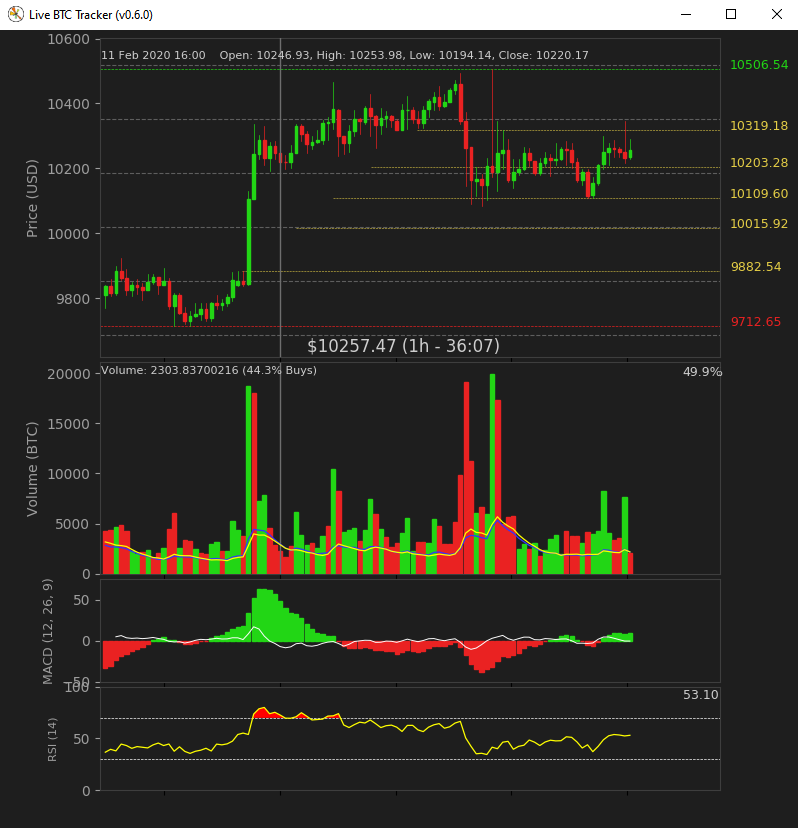

# LiveBtcTracker
Live Bitcoin chart averaging data from multiple exchanges (v0.3.0)

It's rough right now, but it works

## Usage
`python LiveBtcTracker.py [options]` (use --help for info on options)

## Requirements/Dependencies
Dependencies must be manual installed at the moment. 
* Python 3.x (2.x has not been tested but may work)
* matplotlib
* requests

## About
This project uses data from multiple exchanges and matplotlib to chart Bitcoin in real-time. This includes a typical candlestick chart, volume bar chart, and MACD histogram. The plot is configurable to different timeframes and interval sizes (although each exchange API can only work with specific time intervals).

Data is currently sourced from the following exchanges:
* Binance
* OKEx
* Coinbase Pro
* Bitfinex
* Gemini

All price information (open, high, low, close) is averaged between all data sources.

Volume information is the sum of all exchanges. Buy volume percentages are based only on Binance as they are they only exchange whose API provides this information. Volume bars are colored based on the percentage of buys during that interval, NOT the price action. (i.e. green bars mean more buys than sells)

MACD histogram is calculated using the averaged price data.

## Example

## Future Work
I plan to update this as it fits my wants and needs. If you have different ideas or desires feel free to fork it. However, you may also make suggestions and requests.
